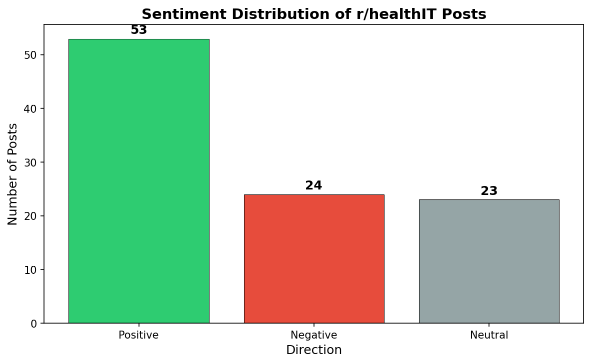
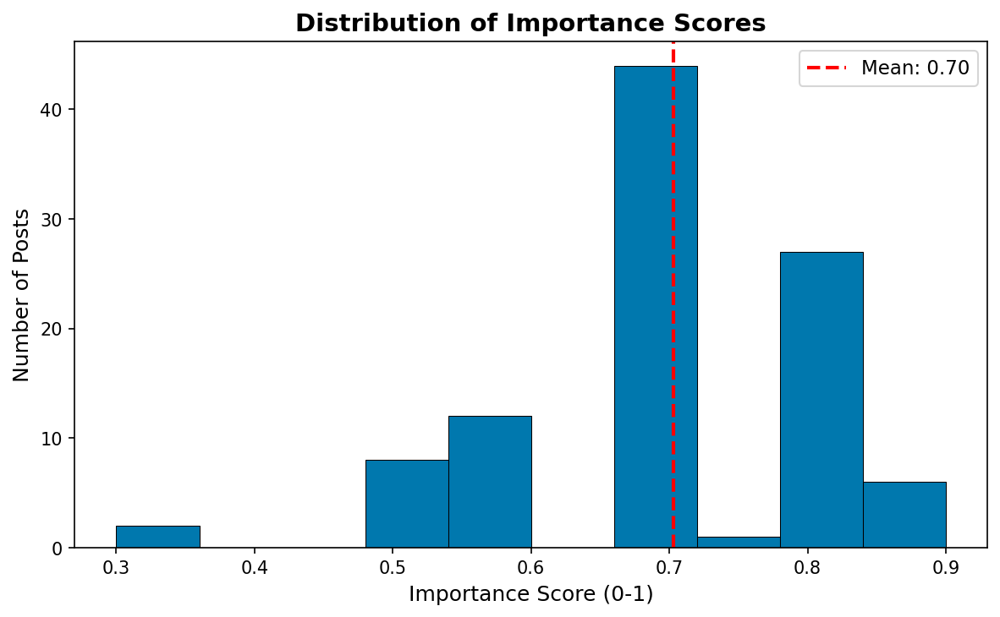

# Healthcare NLP Analysis
**Topic:** Healthcare IT Community Analysis — r/healthIT

---

## Overview
This project scrapes 100 posts from [r/healthIT](https://www.reddit.com/r/healthIT/) — a Reddit community of 51,000+ healthcare IT professionals — and applies two NLP algorithms to summarize content, score importance, and classify sentiment.

The goal is to demonstrate how web scraping and NLP can be used to monitor professional healthcare communities at scale, identifying emerging concerns and workforce priorities without manually reading hundreds of posts.

---

## Part 1: Web Scraping

### Libraries Compared
Two scraping libraries were benchmarked on the same Reddit JSON API endpoint:

| Library | Time (sec) | Lines of Code | Ease of Use (1-5) | Best For |
|---|---|---|---|---|
| BeautifulSoup | 2.47 | 15 | 5 | Static pages & JSON APIs |
| Playwright | 16.07 | 22 | 3 | JavaScript-rendered pages |

### Recommendation
**BeautifulSoup was chosen** for this project. It is 6x faster and significantly simpler for scraping Reddit's JSON API, which returns structured JSON data that does not require JavaScript rendering. Playwright adds value only when the target website loads content dynamically via JavaScript.

### Data Collected
- **Source:** r/healthIT (hot posts, scraped via Reddit JSON API)
- **Volume:** 100 posts (2x the minimum requirement of 50)
- **Fields:** title, post_url, content (post body + top 10 comments combined)
- **File:** `data/scraped_healthcare_posts.csv`

---

## Part 2: Text Analysis

### Algorithm 1: LSA (Latent Semantic Analysis)
LSA is an **extractive** summarization method — it picks the most important sentences directly from the original text using a linear algebra technique called Singular Value Decomposition (SVD).

- ✅ Free, runs locally, no API key needed
- ✅ Fast — processes 100 posts in ~12 seconds
- ⚠️ Summaries can sound choppy since sentences are extracted, not generated

### Algorithm 2: OpenAI gpt-4o-mini
GPT-4o-mini is an **abstractive** summarization method — it generates new sentences that capture the meaning of the original text. A healthcare-specific system prompt was used to ensure domain-relevant analysis.

- ✅ Smoother, more readable summaries
- ✅ Returns structured JSON: summary + importance score + direction
- ⚠️ Requires API key and costs ~$0.30 for 100 posts

> **Note:** Direction was extended to three categories (Positive/Negative/Neutral) 
> to better represent informational posts that are neither positive nor negative.

### Output
All results saved to `outputs/healthcare_analysis.csv` with columns:

| Column | Description |
|---|---|
| title | Post title |
| post_url | Link to original Reddit post |
| lsa_summary | Extractive summary (LSA) |
| openai_summary | Abstractive summary (gpt-4o-mini) |
| importance_score | Float 0.0–1.0 (healthcare relevance) |
| direction | Positive / Negative / Neutral |

---

## Key Findings

### Sentiment Distribution


Of the 100 posts analyzed:
- **53 Positive** — the community leans toward sharing solutions and career advice
- **24 Negative** — frustrations with EHR systems, regulatory burden, and failed implementations
- **23 Neutral** — informational questions and knowledge-sharing

### Importance Score Distribution


- **Mean score: 0.70 / 1.0** — most posts discuss topics highly relevant to working professionals
- Posts cluster in the 0.7–0.8 range — indicating consistently substantive discussions
- Very few low-scoring posts — r/healthIT skews toward professional content

### Top 10 Most Important Posts

| Title | Score | Direction |
|---|---|---|
| client wanted a healthcare app "like uber for doctors"... | 0.9 | Negative |
| Spent $200K on our EHR implementation and doctors... | 0.9 | Negative |
| Congress Proposes New Cybersecurity Rules and Grants... | 0.9 | Positive |
| Anyone gone through the AI app development process... | 0.9 | Negative |
| Why is EHR integration still such a mess | 0.9 | Negative |
| I analyzed the new HHS Medicaid data for known RPM... | 0.85 | Negative |
| I heard there are a lot of clinicians that prefer... | 0.8 | Negative |
| Insurance panels are holding my therapy practice b... | 0.8 | Negative |
| Why do EHR demos feel smooth but real workflows fe... | 0.8 | Negative |
| From Health IT to Cloud | 0.8 | Positive |

**Key insight:** 8 of the 10 highest-scoring posts are Negative — the community is most engaged when discussing problems: EHR failures, regulatory nightmares, and implementation challenges.

---

## Analyst Narrative
The r/healthIT community is predominantly solution-oriented (53% Positive), yet the most critically important discussions are negative — centered on EHR usability failures, AI regulatory uncertainty, and cybersecurity threats. This pattern suggests that while professionals share knowledge generously, the issues driving the highest engagement are systemic pain points that healthcare organizations have not yet resolved.

For organizations like VCH or Fraser Health, this type of NLP pipeline could be used to monitor professional communities at scale — identifying emerging technology concerns, tracking sentiment around new EHR implementations, and understanding workforce priorities without manually reading hundreds of posts.

---

## Project Structure
```
healthcare-nlp-analysis/
├── data/
│   └── scraped_healthcare_posts.csv    ← 100 scraped posts
├── notebooks/
│   ├── part1_scraping.ipynb            ← Benchmark + scraper
│   ├── part2_analysis.ipynb            ← LSA + OpenAI analysis
│   └── playwright_benchmark.py         ← Playwright helper script
├── outputs/
│   ├── healthcare_analysis.csv         ← Final results (PRIMARY DELIVERABLE)
│   ├── sentiment_chart.png             ← Sentiment bar chart
│   └── importance_histogram.png        ← Importance score histogram
├── .env                                ← API key (NOT committed)
├── .gitignore
├── requirements.txt
└── README.md
```

## Setup Instructions
```bash
# 1. Clone the repository
git clone https://github.com/desporamon/healthcare-nlp-analysis.git

# 2. Create and activate virtual environment
python -m venv venv
venv\Scripts\activate  # Windows

# 3. Install dependencies
pip install -r requirements.txt

# 4. Install Playwright browser
playwright install chromium

# 5. Add your OpenAI API key
# Create a .env file with: OPENAI_API_KEY=sk-your-key-here

# 6. Run notebooks in order
# notebooks/part1_scraping.ipynb → then notebooks/part2_analysis.ipynb
```

---

## Dependencies
See `requirements.txt` for full list. Key libraries:
- `requests`, `beautifulsoup4` — web scraping
- `playwright` — browser automation (benchmark only)
- `sumy`, `nltk` — LSA summarization
- `openai`, `python-dotenv` — GPT-4o-mini analysis
- `pandas`, `matplotlib`, `seaborn` — data processing and visualization
- `tabulate`, `tqdm` — formatting and progress tracking
